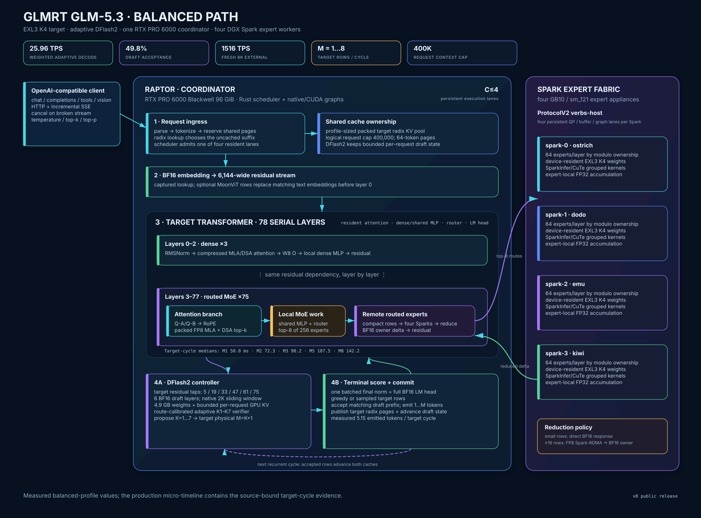
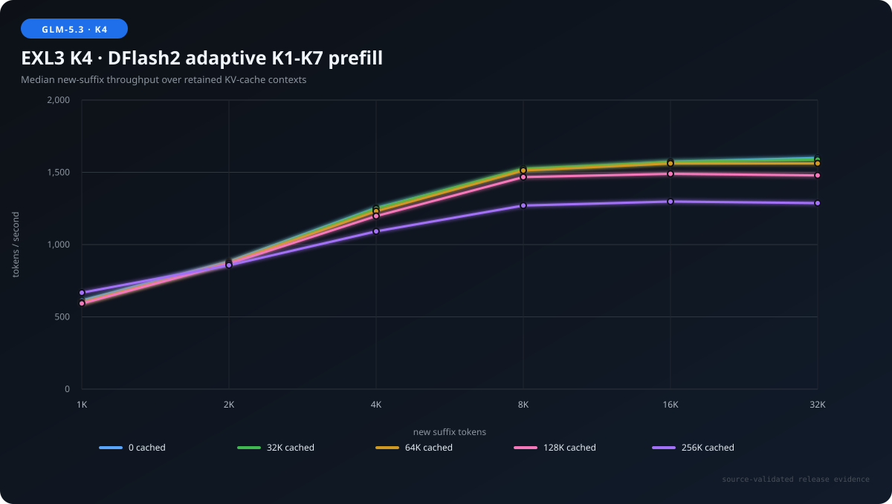
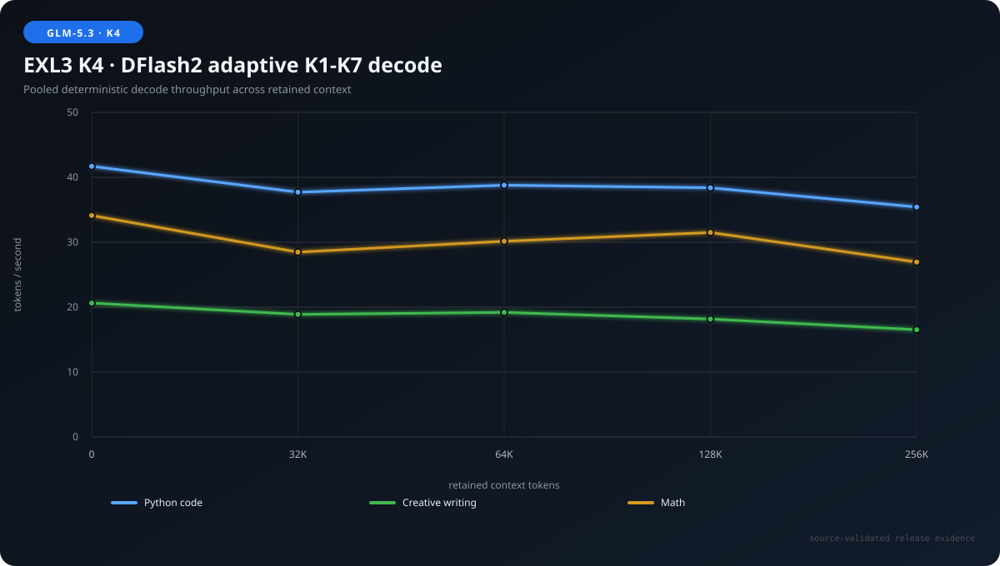
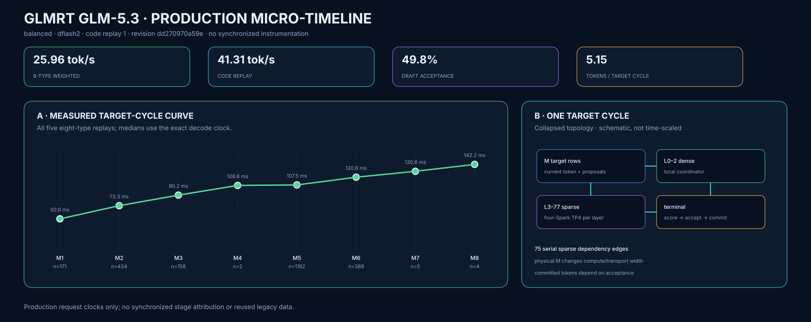
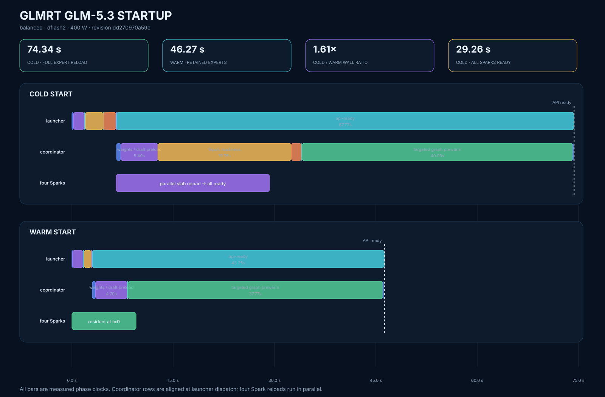

# GLMRT — GLM-5.3 inference engine

## 4x Spark + 1x RTX 6000 @ 52 tok/s decode + 1,600 tok/s prefill

<sub>X-style balanced-profile peaks: low-entropy DFlash2 decode and fresh large prefill.</sub>

## What

GLMRT is a Rust-based Attention–FFN Disaggregation (AFD) inference engine for
[`wrldsuksgo2mars/GLM-5.3-EXL3-K4-v1`](https://huggingface.co/wrldsuksgo2mars/GLM-5.3-EXL3-K4-v1).
One RTX PRO 6000 Blackwell 96 GB coordinator owns attention, scheduling, KV
cache, sampling, speculative decoding, and the OpenAI-compatible API. Four
NVIDIA DGX Sparks hold and execute the routed MoE experts.

The production default is adaptive
[`incoai/GLM-5.3-DFlash2`](https://huggingface.co/incoai/GLM-5.3-DFlash2),
with native MTP available as an alternate. The engine provides continuous
batching at concurrency four, 400K context in the balanced profile, strict tool
and structured-output constraints, reasoning, vision, and radix-prefix reuse.

It is zippy: about 41 tok/s on the real Python coding workload, 52 tok/s on a
low-entropy prompt, up to 82 tok/s aggregate at concurrency four, and about
1,600 tok/s on large fresh prefills.

## Why

I wanted a high-quality local GLM-5.3 using the hardware I already had, and a
custom AFD engine was the best way to make the large GPU and four Sparks work
together.

I built GLMRT for fun through an agentic process. One agent implemented it; a
second was a discussion partner that helped sharpen my thinking before I gave
instructions to the coding agent. The project started with GPT-5.5 + DeepSeek
V4 Pro and later switched to GPT-5.6 Sol + Grok 4.5, which was a big upgrade.

I am releasing it because it is cool, intelligence should be everywhere, and
it may be useful to someone customizing an inference engine for their own
hardware.

## Architecture

[](docs/balanced-path-architecture.svg)

## How to use it

Clone the repository and edit the four Spark host names and network addresses
in `glmrt.config`. The other defaults can be left alone. The default
`MODEL=glm53-exl3` and `SPECULATION=dflash2` select the measured release path.

Build and run both architecture-specific images:

```bash
./build.sh
./run.sh
```

`build.sh` builds the coordinator image locally, builds the ARM expert image
on the first configured Spark, and distributes it to the other Sparks.
Release maintainers can publish both current images as `v8` and `latest` with:

```bash
./push-containers.sh v8
```

To use the v8 images from GitHub Container Registry instead:

```bash
docker pull ghcr.io/tpurtell/glmrt-5.3-coordinator:v8

for host in spark-a spark-b spark-c spark-d; do
  ssh "$host" docker pull ghcr.io/tpurtell/glmrt-5.3-spark-expert:v8
done
```

Set the images in `glmrt.config` and run:

```ini
COORDINATOR_DOCKER_INFERENCE=ghcr.io/tpurtell/glmrt-5.3-coordinator:v8
SPARK_EXPERT_DOCKER_INFERENCE=ghcr.io/tpurtell/glmrt-5.3-spark-expert:v8
```

```bash
./run.sh
```

The server exposes an OpenAI-compatible API at `http://localhost:8000/v1` by
default. Model weights are not included. The GLM-5.3 EXL3 K4 target must be in
the Hugging Face cache on all five hosts; the DFlash2 checkpoint is needed on
the coordinator. The complete calibrated K4 creation and qualification recipe
is in [`quantization/README.md`](quantization/README.md).

## High Level Benchmarks

All results below were measured on one 400 W RTX PRO 6000 Blackwell 96 GB
coordinator and four resident DGX Spark expert workers. The target is
`wrldsuksgo2mars/GLM-5.3-EXL3-K4-v1` at revision
`dd270970a59e6978ddbe14a527b6060e1073fcd1`; DFlash2 is revision
`425aa615ce320caac34400208b30808c8f14f76c`. Except for the profile comparison,
every measurement used the balanced profile.

The v8 runtime targets revision
`47af23347db743b4666d952e2eb48f2b01c3fede`, which corrects the quant's chat
template. The benchmark figures retain the earlier measured revision above;
the template-only update did not change the measured engine path.

| Speculation | Weighted decode | Python code | Low entropy | Acceptance |
|---|---:|---:|---:|---:|
| Native MTP | 23.06 tok/s | 23.92 tok/s | 36.55 tok/s | 55.3% |
| DFlash2 adaptive K1–K7 | 25.96 tok/s | 41.43 tok/s | 51.86 tok/s | 49.8% |

Weighted decode pools five complete replays of eight semantic workload types.
The low-entropy workload requests repeated `orchid` tokens and is a speed-only
X-style probe, not a counting-quality test.

### DFlash2 policy

| Policy | Weighted decode | C1/C2/C4 geometric mean | Response-performance score |
|---|---:|---:|---:|
| Adaptive K1–K7 | 25.96 tok/s | 62.77 tok/s | 32.793 |
| Fixed K5 | 24.67 tok/s | 62.45 tok/s | 31.923 |

Adaptive verification improves weighted decode by 5.21% over fixed K5.

### Eight-type decode

| Type | Native MTP | MTP acceptance | DFlash2 | DFlash2 acceptance |
|---|---:|---:|---:|---:|
| Python code | 23.92 tok/s | 60.2% | 41.43 tok/s | 83.0% |
| Math reasoning | 26.34 tok/s | 53.5% | 37.05 tok/s | 75.8% |
| Creative prose | 22.14 tok/s | 37.7% | 20.70 tok/s | 36.2% |
| Short response | 16.34 tok/s | 21.5% | 23.42 tok/s | 46.7% |
| Exposition | 22.36 tok/s | 53.0% | 25.99 tok/s | 48.2% |
| Natural JSON | 28.72 tok/s | 59.7% | 30.50 tok/s | 56.3% |
| Constrained JSON Schema | 29.04 tok/s | 61.2% | 30.87 tok/s | 62.3% |
| Multilingual | 23.01 tok/s | 56.5% | 23.34 tok/s | 40.3% |

### Prefill

Each cell is median new-suffix throughput after retaining the row's base
context in KV cache.

| Cached context | +1K | +2K | +4K | +8K | +16K | +32K |
|---:|---:|---:|---:|---:|---:|---:|
| 0 | 613 | 883 | 1,254 | 1,516 | 1,573 | 1,599 |
| 32K | 599 | 871 | 1,249 | 1,525 | 1,571 | 1,588 |
| 64K | 597 | 874 | 1,231 | 1,513 | 1,561 | 1,561 |
| 128K | 593 | 868 | 1,197 | 1,467 | 1,490 | 1,479 |
| 256K | 667 | 857 | 1,092 | 1,270 | 1,298 | 1,287 |



### Decode across retained context

Each cell pools two deterministic DFlash2 responses. Nonzero base contexts are
primed once and reused by all three workloads.

| Context | Python code | Creative writing | Math |
|---:|---:|---:|---:|
| 0 | 41.69 | 20.62 | 34.11 |
| 32K | 37.71 | 18.88 | 28.47 |
| 64K | 38.79 | 19.19 | 30.16 |
| 128K | 38.39 | 18.17 | 31.50 |
| 256K | 35.42 | 16.53 | 26.95 |



### Concurrency

| Concurrent requests | Median aggregate | Scaling |
|---:|---:|---:|
| 1 | 42.11 tok/s | 1.00x |
| 2 | 71.97 tok/s | 1.71x |
| 4 | 81.60 tok/s | 1.94x |

### Tool use

`tool-eval-bench` ran all 69 scenarios serially with thinking enabled. Each run
used a distinct seed.

| Seed | Points | Displayed score |
|---:|---:|---:|
| 2026082901 | 125/138 | 91 |
| 2026082902 | 125/138 | 91 |
| 2026082903 | 125/138 | 91 |
| **Median** | **125/138** | **91** |

### Pi coding-agent task

| Reasoning | Wall time | Turns | Tool calls | Tool errors | Fresh input | Cache read | Output | Reasoning | Total | File |
|---|---:|---:|---:|---:|---:|---:|---:|---:|---:|---:|
| Off | 558.72 s | 12 | 11 | 3 | 3,924 | 177,309 | 17,268 | 0 | 198,501 | 38.4 KB |
| High | 3,281.84 s | 4 | 3 | 0 | 1,631 | 188,114 | 62,118 | 43,547 | 251,863 | 50.1 KB |

`Total` is fresh input + cache read + output. Reasoning is a subset of output
and is shown without being added twice.

### Needle in a haystack

Each exact-length prompt contained unique secret codes at roughly 10%, 50%,
and 90% depth. All 15 DFlash2 requests returned the exact key.

| Context | 10% | 50% | 90% | Slowest request |
|---:|:---:|:---:|:---:|---:|
| 8K | Pass | Pass | Pass | 5.60 s |
| 32K | Pass | Pass | Pass | 20.71 s |
| 128K | Pass | Pass | Pass | 87.21 s |
| 256K | Pass | Pass | Pass | 191.27 s |
| 384K | Pass | Pass | Pass | 310.79 s |

## Micro-timeline Benchmarks

[](docs/glm53-balanced-micro-timeline.svg)

The selected code replay produced 41.31 tok/s over 4,865.54 ms and 39 target
cycles. The graph also shows the measured physical-M target-cycle curve.

## Startup Time

| Launch state | Ready wall time |
|---|---:|
| Cold — reload four expert slabs | 74.34 s |
| Warm — retain matched experts | 46.27 s |

[](docs/glm53-startup-timeline.svg)

## Performance by Profile

Only this section varies the serving profile. Weighted decode uses the same
five-replay mixed workload; prefill is a fresh +8K suffix over a retained 2K
base.

| Profile | Weighted decode | Verify throughput | Acceptance | Cached 2K + fresh 8K |
|---|---:|---:|---:|---:|
| Balanced | 25.96 tok/s | 26.55 tok/s | 49.8% | 1,505.00 tok/s |
| Long | 24.66 tok/s | 24.89 tok/s | 48.5% | 1,487.98 tok/s |
| Accuracy | 20.00 tok/s | 21.60 tok/s | 65.1% | 1,044.16 tok/s |

Agents customizing the engine should start with [`DEVELOPER.md`](DEVELOPER.md).
GLMRT is released under the [MIT License](LICENSE).
